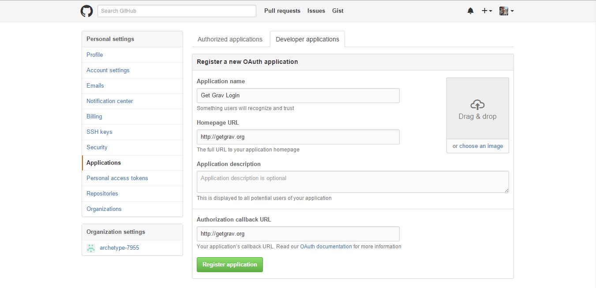
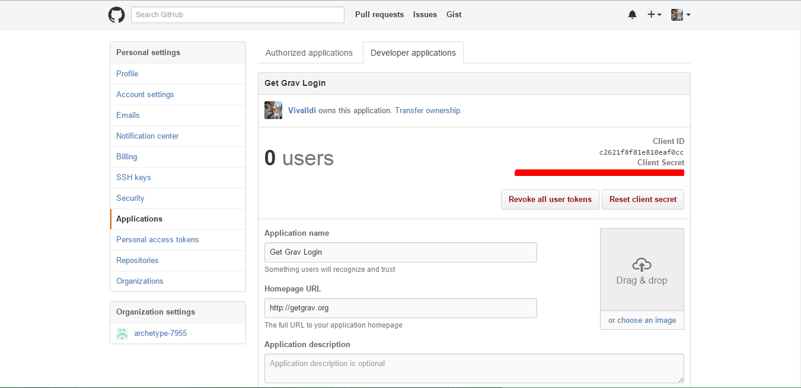
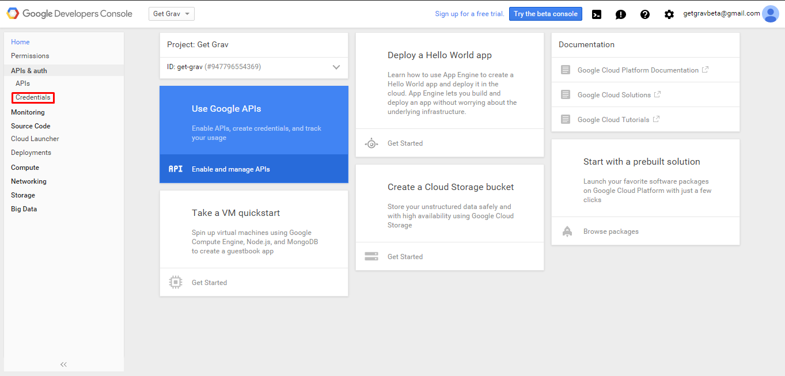
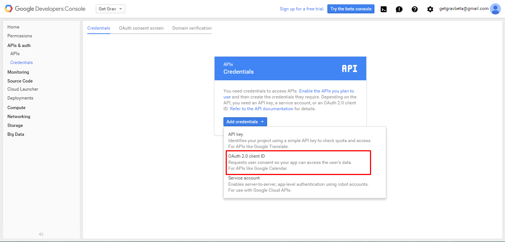

# Grav Login Plugin

The **login plugin** for [Grav](http://github.com/getgrav/grav) adds login, basic ACL, and session wide messages to Grav.  It is designed to provide a way to secure front-end and admin content throughout Grav.

# Installation

The **login** plugin actually requires the help of the **email** and **form** plugins. The **email** plugin is needed to ensure that you can recover a password via email if required.  The **form** plugin is used to generate the forms required.

These are available via GPM, and because the plugin has dependencies you just need to proceed and install the login plugin, and agree when prompted to install the others:

```
$ bin/gpm install login
```

# Creating Users

You can either use the built-in CLI capabilities, or you create a user manually by creating a new YAML file in your `user/acounts` folder.


# CLI Usage

The simplest way to create a new user is to simply run the `bin/plugin login newuser` command. This will take you through a few questions to gather information with which to create your user. You can also use inline arguments to avoid the interactive questions.

### Commands

| Command       | Arguments                            | Explination                |
|---------------|--------------------------------------|----------------------------|
|`newuser`|Aliases: `add-user`, `new-user`|Creates a new user (creates file in `user/accounts/`)
|| [ -u, --user=USER ]               | The username.                                                   |
|| [ -p, --password=PASSWORD ]       | The password. Ensure the password respects Grav's password policy. **Note that this option is not recommended because the password will be visible by users listing the processes.** |
|| [ -e, --email=EMAIL ]             | The user email address.                                         |
|| [ -P, --permissions=PERMISSIONS ] | The user permissions. It can be either `a` for Admin access only, `s` for Site access only and `b` for both Admin and Site access. |
|| [ -N, --fullname=FULLNAME ]       | The user full name                                              |
|| [ -t, --title=TITLE ]             | The title of the user. Usually used as a subtext. Example: Admin, Collaborator, Developer |
|| [ -s, --state=STATE ]             | The state of the account. Either `enabled` (default) or `disabled` |
|||
|`changepass`|Aliases: `newpass`, `passwd`|Changes password of the specified user (User file must exist)
|| [ -u, --user=USER ]               | The username.                                                   |
|| [ -p, --password=PASSWORD ]       | The new password. Ensure the password respects Grav's password policy. **Note that this option is not recommended because the password will be visible by users listing the processes.** |


### CLI Example
```
> bin/plugin login newuser -u joeuser -p 8c9sRCeBExAiwk -e joeuser@grav.org -P b -N "Joe User" -t "Site Administrator"
Creating new user


Success! User joeuser created.
```

### Interactive Example
```
> bin/plugin login newuser
Creating new user

Enter a username: joeuser
Enter a password: 8c9sRCeBExAiwk
Enter an email:   joeuser@grav.org
Please choose a set of permissions:
  [a] admin access
  [s] site access
  [b] admin and site access
 > b
Enter a fullname: Joe User
Enter a title:    Site Administrator
Please choose the state for the account:
  [enabled ] Enabled
  [disabled] Disabled
 > enabled

Success! User joeuser created.
```

### Manual User Creation

Here is example user defined in `user/accounts/admin.yaml`:

```
password: password
email: youremail@mail.com
fullname: Johnny Appleseed
title: Site Administrator
access:
  admin:
    login: true
    super: true
```

>> Note: the username is based on the name of the YAML file.

# Usage

You can add ACL to any page by typing something like below into the page header:

```
access:
  site.login: true
  admin.login: true
```

Users who have any of the listed ACL roles enabled will have access to the page.
Others will be forwarded to login screen.

Because the admin user contains an `admin.login: true` reference he will be able to login to the secured page because that is one of the conditions defined in the page header. You are free to create any specific set of ACL rules you like.  Your user account must simply contain those same rules if you wish the user to have access.

## Create Private Areas

Enabling the setting "Use parent access rules" (`parent_acl` in login.yaml) allows you to create private areas where you set the access level on the parent page, and all the subpages inherit that requirement.

# Login Page

>> Note: the **frontend site** and **admin plugin** use different sessions so you need to explicitly provide a login on the frontend.

The login plugin can **automatically generate** a login page for you when you try to access a page that your user (or guest account) does not have access to.

Alternatively, you can also provide a specific login route if you wish to forward users to a specific login page. To do this you need to create a copy of the `login.yaml` from the plugin in your `user/config/plugins` folder and provide a specific route (or just edit the plugin setttings in the admin plugin).

```
route: /user-login
```

You would then need to provide a suitable login form, probably based on the one that is provided with the plugin.

# Logout

The login plugin comes with a simple Twig partial to provide a logout link (`login-status.html.twig`).  You will need to include it in your theme however.  An example of this can be found in the Antimatter theme's `partials/navigation.html.twig` file:

```

    <li><i class="fa fa-lock"></i> </li>

```

You can also copy this `login-status.html.twig` file into your theme and modify it as you see fit.

# Allow User Registration

The Login plugin handles user registration.
To enable the built-in registration form, in the Login Plugin configuration enable user registration and just add a value to the "Registration path" field.

Then just open your browser on that page, and you'll be presented a registration form.

## Adding the registration page to the menu

Here are two ways you can do it, but of course Grav is flexible and you can come up with other ways too.

The first and easiest way is to add a page with the same slug (route) as the registration form. So for example if in the Login Plugin settings you set /register as the registration form path, then create a `04.register` page (the 04 number is just an example, use your own ordering), with no content.
The Login plugin will "override" that page, serving the registration page form when the user clicks on that menu item.

A second way is to add a custom menu item that points to the registration page, by editing `site.yaml` with this code, that will append a "Register" menu item:

```
menu:
  -
    url: 'register'
    text: Register
```

This works in most themes, Antimatter included, but it's not guaranteed to work in all themes, as it's something that must be added to the navigation twig code.

## Customizing the registration form

The provided registration form is just a quick way to start using it. You might however need different fields on the registration form, or you want to add more content. Here's how to do it.

First, create a registration form page.

Create a folder `04.registration/form.md`. The folder name is just an example. Pick the one that suits you. The important part is the file name: since we're building a form, we need a `form.md` file.

Also, your theme needs to implement forms. Use Antimatter or another form-compatible theme if yours does not work, then once you're setup with the form you can migrate the forms files and make it work on your theme too.

Add the following content to your registration form page:

```
---
form:
  fields:
    -
      name: username
      type: text
      validate:
        required: true
        message: PLUGIN_LOGIN.USERNAME_NOT_VALID
        pattern: '^[a-z0-9_-]{3,16}$'

    -
      name: email
      type: text
      validate:
        required: true
        message: PLUGIN_LOGIN.EMAIL_VALIDATION_MESSAGE

    -
      name: password1
      type: password
      label: Enter a password
      validate:
        required: true
        message: PLUGIN_LOGIN.PASSWORD_VALIDATION_MESSAGE
        pattern: '(?=.*\d)(?=.*[a-z])(?=.*[A-Z]).{8,}'

    -
      name: password2
      type: password
      label: Repeat the password
      validate:
        required: true
        message: PLUGIN_LOGIN.PASSWORD_VALIDATION_MESSAGE
        pattern: '(?=.*\d)(?=.*[a-z])(?=.*[A-Z]).{8,}'

  buttons:
      -
          type: submit
          value: Submit
      -
          type: reset
          value: Reset

  process:
      register_user: true
      display: '/welcome'
      message: "Welcome to my site!"
---

# Registration
```

This is a normal form. The only thing different from a contact form or another form that you might write on your site is the process field `register_user`, which takes care of processing the user registration.

Once the user is registered, Grav redirects the user to the `display` page with the `message` message.

The only field strictly required by Grav is `username`. Then the other fields can be added as needed.

For example in this case we added

- password1
- password2

to the form. And, in the Login plugin configuration we have by default enable the double password verification with the "Validate double entered password" option. What this does is picking the password1 and password2 fields, validate them, check they are equal and put the content in the `password` field.

You can avoid having 2 fields for the password, which by the way is a recommended option, and just put a single `password` field.

Last important thing before the registration is correctly setup: make sure in the Login plugin settings you have the user registration enabled, otherwise the registration will trigger an error, as by default user registration is DISABLED.

## Sending an activation email

By default the registration process adds a new user, and sets it as enabled.
Grav allows disabled user accounts, so we can take advantage of this functionality and add a new user, but with a disabled state. Then we can send an email to the user, asking to validate the email address.

That validation email will contain a link to set the user account to enabled. To do this, just enable "Set the user as disabled" and "Send activation email" in the Login Plugin options.

## Send a welcome email

Enable "Send welcome email" in the options.

The content of the welcome email is defined in the language file, strings `PLUGIN_LOGIN.WELCOME_EMAIL_SUBJECT` and `PLUGIN_LOGIN.WELCOME_EMAIL_BODY`. Customize them as needed in your language file override.

Note: if the activation email is enabled, the welcome email to be sent upon the account activation action (when the user clicks the link to activate the account)

## Send a notification email to the site owner

Enable "Send notification email" in the options.

The content of the notification email is defined in the language file, strings `PLUGIN_LOGIN.NOTIFICATION_EMAIL_SUBJECT` and `PLUGIN_LOGIN.NOTIFICATION_EMAIL_BODY`. Customize them as needed in your language file override.

Note: if the activation email is enabled, the notification email to be sent upon the account activation action (when the user clicks the link to activate the account)

## Adding your own fields

If you want to add your own custom fields to the registration form, just add fields to the form like you would with any other form.

Then, to let the Login plugin add those fields to the user yaml file, you also need to add it to the "Registration fields" option in the Login Plugin configuration.

By default we have

```
    - 'username'
    - 'password'
    - 'email'
    - 'fullname'
    - 'title'
    - 'access'
    - 'state'
```

Add your own as you prefer, to build any custom registration form you can think of.

## Specifying a default value for a field

If you want to pre-fill a field, without showing it to the user in the form, you could set it as an hidden field. But the user could see it - and modify it via the browser dev tools.

To add a field and make sure the user cannot modify it, add it to "Default values" list.

## Login users directly after the registration

Just enable "Login the user after registration"

If the user activation email is enabled, the user will be logged in as soon as the activation link is clicked.

## Add captcha to the user registration

Add a captcha like you would with any form:

Add

```
        - name: g-recaptcha-response
          label: Captcha
          type: captcha
          recatpcha_site_key: aeio43kdk3idko3k4ikd4
          recaptcha_not_validated: 'Captcha not valid!'
          validate:
            required: true
```

to the form field, and

```
process:
  - captcha
```

to validate it server-side. Put this process action before all the other actions, so it's processed first and the user is not created if the captcha is not valid.

## Redirect to another page after login

You can set the "Redirect after registration" option in the Login plugin, or as with any form, use the `process.display` property, and set it to the destination page route:

```
  process:
     -
       display: /welcome
```


# OAuth

You can add OAuth providers to the login plugin as another method to have users on your site. To enable OAuth change `oauth.enabled` to `true` in `login.yaml`. By default OAuth allows users to login though they do not create an account file for the user. If you want an account file created (ex: for tracking purposes) change `oauth.user.autocreate` to `true` in `login.yaml`.
>Note: OAuth has not been tested with Grav's multilang feature! Due to this, certain OAuth providers may not function properly on multilang sites

>IMPORTANT: `localhost` may NOT be used for callback and allowed URLs when creating OAuth provider applications due to certificate verification issues. Some services allow other URLs and it may be possible to add custom domains pointing to 127.0.0.1 in your hosts file and point applications there.

## Facebook

Visit https://developers.facebook.com/quickstarts/?platform=web and create an app name then click **Create New Facebook App ID.**

Choose a category most similar to your business then click **Create App ID.**

Scroll down on the next screen to the section titled **Tell us about your website.** Input a URL for the site (no need to include the protocol). Click **Next**

Click **Skip Quick Start** Copy the **App ID** and **App Secret** into `login.yaml`

On the left hand side click **Settings**
In the **Basic** tab add your domain into the **App Domains** section as well as enter a contact email (required for facebook developer program). In the **Advanced** tab scroll down to the **Client OAuth Settings** Make sure that **Client OAuth Login** is enabled as well as **Web OAuth Login** is enabled. In the **Valid OAuth redirect URIs** section add the routes of all pages that are protected by login. This includes the domains. EX: `http://getgrav.org/`, `http://getgrav.org/login`, `http://getgrav.org/en/login`, and `http://getgrav.org/protected/page/route`


## Github

Visit Github's [Developer Applications Console](https://github.com/settings/developers) and press button **Register new application** (login if necesarry). 

Fill out the name and the URL (can be anything) and fill in the **callback**, which must be equal to where your grav site is located, generally just the host, i.e. `http://getgrav.org`. 

Copy **Client ID** and **client secret** into login.yaml under Github. Be sure to change `Github.enabled` to `true`

## Google

Visit the [Google Developers Console](https://console.developers.google.com) (sign in with a google account, preferably your businesses gmail).

Select **Create Project** and give the project a name (can be anything). Click **Create**. 

When it's finished creating in the left hand menu choose **Credentials** under **APIs & Auth** (you may need to click **APIs & Auth** in order to display **Credntials**). 

Under **Add credentials** (center of screen) select **OAuth 2.0 client ID**.

Then select **Configure consent screen** in the top right corner. 

The only requirement is **Product name** which should be the name of your website/business (not a url). You may fill in the other options as you want on the consent screen. (The consent screen can also be changed later). 

Then once you save the consent screen select **Web application** from the radio buttons and fill in the fields. **Name** being name of product/business. **Authorized Javascript origins** is the root domain name of the login page (no routes or wildcards) such as `http://getgrav.org`.

If needed, enter multiple sub domains, creating an entry for each. **Authorized redirect URIs** include the **same** Authorized Javascript origins used along with the **route** to the login page such as `http://getgrav.org/login`. Click **create**.


Copy **Client ID** and **client secret** into login.yaml under Google. Be sure to change `Google.enabled` to `true`

## Twitter

Login if necessary. Create a [new Twitter App](https://apps.twitter.com/app/new) , fill out name, application website, choose "Browser" as application type, choose the callback URL like above, default access type can be set to read-only, click on "Register application" and then you should be directed to your new application with the Client ID and secret ready to be copied and pasted into the YAML file.

# Known issues

When updating from an older version, pre-october 2015, you might have an error `Class 'Grav\Login\Controller' Not Found`. The problem is during the update, since a file name was changed from lowercase to capitalized. Solution: reinstall the Login plugin, or change the file name `user/plugins/login/classes/controller.php` to `user/plugins/login/classes/Controller.php` (notice the capital `C`).
